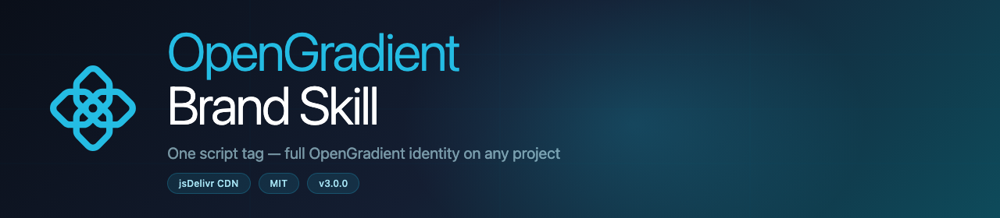

<div align="center">



# OpenGradient Brand Skill

**Drop one `<script>` tag into any project — get full OpenGradient visual identity instantly.**

[](https://cdn.jsdelivr.net/gh/golldyck/opengradient-brand-skill@main/og-skill.js)
[](https://github.com/golldyck/opengradient-brand-skill)
[](LICENSE)

<p>
  <a href="https://opengradient.ai">
    
  </a>
  <a href="https://github.com/golldyck/opengradient-brand-skill">
    
  </a>
  <a href="https://opengradient.notion.site/Branding-Kit-b0ed295da43f479dbbd0e603029666b1">
    
  </a>
</p>

<p>
  <a href="https://x.com/opengradient">
    
  </a>
  <a href="https://discord.gg/opengradient">
    
  </a>
</p>

[Live Demo](https://cdn.jsdelivr.net/gh/golldyck/opengradient-brand-skill@main/demo.html) • [Brand Kit](https://opengradient.notion.site/Branding-Kit-b0ed295da43f479dbbd0e603029666b1) • [opengradient.ai](https://opengradient.ai)

</div>

---

## 📑 Table of Contents

- [🤖 Use with AI (Gemini, Claude, ChatGPT)](#-use-with-ai-gemini-claude-chatgpt)
- [🎯 Use in websites (script tag)](#-what-is-this)
- [⚡ Quick Start](#-quick-start)
- [🔧 Usage Options](#-usage-options)
- [🎨 Brand Tokens](#-brand-tokens)
- [🧩 CSS Components](#-css-components)
- [📐 JavaScript API](#-javascript-api)
- [🖼️ Image Branding](#️-image-branding)
- [📁 Files](#-files)
- [🔗 CDN Links](#-cdn-links)

---

## 🤖 Use with AI (Gemini, Claude, ChatGPT)

Paste the prompt below into any AI — it will understand the full OpenGradient brand and create images, websites, UI, or photos in the correct style.

**Click the copy icon** (top-right of the box) → paste into Gemini / Claude / ChatGPT / Midjourney → describe what you want.

```
OPENGRADIENT BRAND CONTEXT — paste this into any AI, then describe what you want to create.

BRAND: OpenGradient — open platform for decentralized AI inference (blockchain + ML).

COLORS (use exactly):
  Primary Blue:   #24bce3  ← headlines, CTAs, icons, glows
  Dark Teal:      #0e4b5b  ← dark text on light bg
  Navy Black:     #0a0f19  ← main background
  Navy Mid:       #141e32  ← cards, secondary sections
  Light Blue:     #bdebf7  ← body text on dark bg
  Accent Light:   #50c9e9  ← softer blue accent
  White:          #ffffff

GRADIENTS:
  Hero bg:   #0a0f19 → #141e32 → #0e4b5b (135deg)
  Brand:     #24bce3 → #0e4b5b
  Glow:      radial, #24bce3 at 25% opacity, bottom-center

TYPOGRAPHY:
  Font: Geist (by Vercel) — weight 300/400/500
  Mono: Geist Mono — for code and data
  Headings: font-weight 300, letter-spacing -0.025em

LOGO: Geometric cross/diamond mark of 8 interlocking diamonds in 3×3 grid with center circle.
  Color: always #24bce3 on dark, #0e4b5b on light. Never add gradients to the mark.

VISUAL STYLE:
  - Dark navy backgrounds, brand blue (#24bce3) accents and glows
  - Subtle 1px grid lines at 4% opacity for tech feel
  - Rounded corners (12–20px), glass morphism panels
  - Clean, professional, scientific — NOT neon/cyberpunk
  - Abstract tech imagery: nodes, connections, data flows, geometric patterns

PHOTO STYLE:
  - Dark navy/teal backgrounds, cool blue temperature
  - Brand blue (#24bce3) light sources and glows
  - Color grade: boost blues/teals, desaturate reds/yellows
  - Overlay: #0a0f19 at 60% → #24bce3 at 15% gradient

DO NOT USE: lime/yellow/green colors, Roboto font, pure black #000, neon aesthetics.

FOR WEBSITES — add this 1 line to any HTML:
<script src="https://cdn.jsdelivr.net/gh/golldyck/opengradient-brand-skill@main/og-skill.js"></script>

Now describe what you want to create →
```

---

## 🌐 Use in Websites (one script tag)

## 🎯 What is this?

**OpenGradient Brand Skill** is a single JavaScript file that applies the real [OpenGradient](https://opengradient.ai) visual identity to any web project — website, landing page, app, or photo overlay.

Drop **one line** into any HTML file:

```html
<script src="https://cdn.jsdelivr.net/gh/golldyck/opengradient-brand-skill@main/og-skill.js"></script>
```

It automatically:

- ✅ Loads the **official OpenGradient CSS** with real brand design tokens
- ✅ Loads **Geist** font (official OG font via Google Fonts)
- ✅ Injects the **official SVG logo** from opengradient.ai into any `[data-og-logo]` element
- ✅ **Auto-builds a complete branded page** from one `<body>` attribute
- ✅ Applies **brand overlays to photos and images**

> No bundler. No npm. No build step. Just paste and go.

---

## ⚡ Quick Start

### Fastest: Full Auto-Build (one attribute)

Add the script + `data-og-build` to your `<body>`:

```html
<!DOCTYPE html>
<html lang="en">
<head>
  <meta charset="UTF-8" />
  <title>My Project</title>

  <!-- ONE LINE — full OpenGradient brand -->
  <script src="https://cdn.jsdelivr.net/gh/golldyck/opengradient-brand-skill@main/og-skill.js"></script>
</head>
<body
  data-og-build
  data-og-title="Your Project Name"
  data-og-tagline="Your tagline here."
  data-og-cta="Get Started"
  data-og-cta-url="https://yoursite.com"
>
</body>
</html>
```

The skill auto-generates a complete page: **Navbar → Hero → Stats → Feature Cards → CTA Banner → Footer** — all in real OpenGradient brand style.

---

## 🔧 Usage Options

### Option A — Auto-Build (full page)

```html
<body data-og-build data-og-title="..." data-og-tagline="..." data-og-cta="..." data-og-cta-url="...">
```

| Attribute | Default | Description |
|---|---|---|
| `data-og-title` | `"OpenGradient"` | Hero headline |
| `data-og-tagline` | `"Decentralized AI..."` | Hero subtext |
| `data-og-cta` | `"Get Started"` | CTA button label |
| `data-og-cta-url` | `"https://opengradient.ai"` | CTA button URL |

---

### Option B — CSS Classes Only

Use brand classes manually in your existing HTML:

```html
<head>
  <link rel="stylesheet"
    href="https://cdn.jsdelivr.net/gh/golldyck/opengradient-brand-skill@main/og-brand.css" />
</head>

<body class="og-scope">
  <h1 class="og-h1 og-text-gradient">Hello World</h1>
  <p class="og-body">Styled with OpenGradient brand.</p>
  <a class="og-btn og-btn-primary" href="#">Launch App</a>
</body>
```

---

### Option C — Logo Only

```html
<script src="https://cdn.jsdelivr.net/gh/golldyck/opengradient-brand-skill@main/og-skill.js"></script>

<!-- Full wordmark (white, for dark backgrounds) -->
<div data-og-logo="wordmark"></div>

<!-- Full wordmark (dark, for light backgrounds) -->
<div data-og-logo="wordmark-dark"></div>

<!-- Icon mark only -->
<div data-og-logo="mark"></div>
```

---

### Option D — Partial Sections

Inject individual branded sections anywhere on your page:

```html
<nav data-og-section="nav"></nav>
<section data-og-section="hero" data-og-title="My Title" data-og-tagline="My tagline"></section>
<footer data-og-section="footer"></footer>
```

---

### Option E — Image Brand Overlay

Apply OpenGradient brand color overlay to any photo:

```html
<!-- Dark brand overlay (default) -->
<div class="og-img-overlay">
  
</div>

<!-- Light brand overlay -->
<div class="og-img-overlay og-img-overlay--light">
  
</div>
```

---

## 🎨 Brand Tokens

Real design tokens extracted from [opengradient.ai](https://opengradient.ai):

```css
/* Primary Brand Colors */
--og-primary-100:    #e9f8fc   /* Light surface */
--og-primary-200:    #bdebf7   /* Light accent */
--og-primary-400:    #50c9e9   /* Soft blue */
--og-primary-500:    #24bce3   /* Main brand blue */
--og-primary-600:    #1d96b6
--og-primary-700:    #167188
--og-primary-800:    #0e4b5b   /* Dark teal */
--og-primary-900:    #041317

/* Dark Navy Scale */
--og-secondary-700:  #1d2c4b
--og-secondary-800:  #141e32   /* Card background */
--og-secondary-950:  #0a0f19   /* Deepest navy */

/* Typography */
--og-font-sans:      'Geist', system-ui, sans-serif
--og-font-mono:      'Geist Mono', ui-monospace, monospace

/* Gradients */
--og-grad-hero:      linear-gradient(135deg, #0a0f19 → #141e32 → #0e4b5b)
--og-grad-primary:   linear-gradient(135deg, #24bce3 → #0e4b5b)
--og-grad-text:      linear-gradient(90deg, #24bce3 → #50c9e9)
```

---

## 🧩 CSS Components

| Class | Description |
|---|---|
| `og-scope` | Root wrapper — applies font + dark bg |
| `og-scope og-light` | Light theme variant |
| `og-container` | Max-width centered container (1200px) |
| `og-hero` | Full-height hero section with gradient bg |
| `og-nav` | Fixed glassmorphism navbar |
| `og-btn og-btn-primary` | Brand blue button |
| `og-btn og-btn-secondary` | Ghost outline button |
| `og-btn og-btn-dark` | Dark teal button |
| `og-btn-sm` / `og-btn-lg` | Button size variants |
| `og-card` | Dark card with hover effect |
| `og-card-glow` | Card with brand radial glow |
| `og-card-featured` | Highlighted/featured card |
| `og-badge og-badge-primary` | Brand blue pill badge |
| `og-h1` … `og-h4` | Heading scale |
| `og-body` | Body text style |
| `og-caption` / `og-label` | Small text styles |
| `og-text-gradient` | Brand gradient text |
| `og-text-primary` | Brand blue text |
| `og-stat` | Large metric/stat display |
| `og-code` | Styled code block (Geist Mono) |
| `og-input` | Branded input field |
| `og-divider` | Gradient horizontal rule |
| `og-grid og-grid-2/3/4` | Responsive grid layouts |
| `og-img-overlay` | Brand color overlay on images/photos |
| `og-reveal` | Scroll-triggered fade-in animation |
| `og-cta-banner` | Full-width CTA section |
| `og-testimonial` | Testimonial card component |
| `og-price-list` | Checkmark feature list |

---

## 📐 JavaScript API

```js
// Build a full branded page programmatically:
OGBrand.buildPage(document.body);

// Inject official logos into [data-og-logo] elements:
OGBrand.injectLogos();

// Initialize scroll-reveal animations:
OGBrand.initScrollReveal();

// Initialize mobile hamburger nav:
OGBrand.initMobileNav();

// Load CSS / fonts manually:
OGBrand.loadCSS(url);
OGBrand.loadFonts(url);

// Official SVG strings:
OGBrand.LOGO_SVG    // Full wordmark (643×121)
OGBrand.LOGO_MARK   // Icon mark only (121×121)

// Brand color palette:
OGBrand.COLORS = {
  primary:    '#24bce3',
  dark:       '#0e4b5b',
  navy:       '#0a0f19',
  light:      '#e9f8fc',
  primary400: '#50c9e9',
  primary600: '#1d96b6',
  primary800: '#0e4b5b',
}

// Version:
OGBrand.VERSION     // '3.0.0'
```

---

## 🖼️ Image Branding

Apply OpenGradient brand aesthetic to any image or photo:

```html
<div class="og-img-overlay">
  
</div>
```

<details>
<summary>Click to see overlay variants</summary>

| Class | Effect |
|---|---|
| `og-img-overlay` | Dark navy + brand blue gradient overlay |
| `og-img-overlay og-img-overlay--light` | Light teal overlay (for light-bg contexts) |

The overlay uses `position: absolute` so the image stays fully visible with a brand-colored gradient layer on top.

</details>

---

## 📁 Files

| File | Description |
|---|---|
| `og-skill.js` | Main skill — load via CDN, auto-fetches everything |
| `og-brand.css` | Brand stylesheet — auto-loaded by the skill |
| `demo.html` | Full auto-build demo (open in browser) |
| `test-local.html` | Local test page (no CDN dependency) |

---

## 🔗 CDN Links

```
JS:  https://cdn.jsdelivr.net/gh/golldyck/opengradient-brand-skill@main/og-skill.js
CSS: https://cdn.jsdelivr.net/gh/golldyck/opengradient-brand-skill@main/og-brand.css
```

> **Note:** jsDelivr CDN takes ~5 minutes to propagate after a push to `main`.

---

## 📖 Brand Reference

Built from the official [OpenGradient](https://opengradient.ai) brand:

- **Primary**: `#24bce3` — brand blue
- **Dark**: `#0e4b5b` — brand teal
- **Navy**: `#0a0f19` — deepest background
- **Font**: Geist + Geist Mono
- **Logo**: Official SVG wordmark (sourced from opengradient.ai, uses `currentColor`)

Brand assets: [Notion Brand Kit](https://opengradient.notion.site/Branding-Kit-b0ed295da43f479dbbd0e603029666b1)

---

## License

MIT — free to use in any OpenGradient project.
